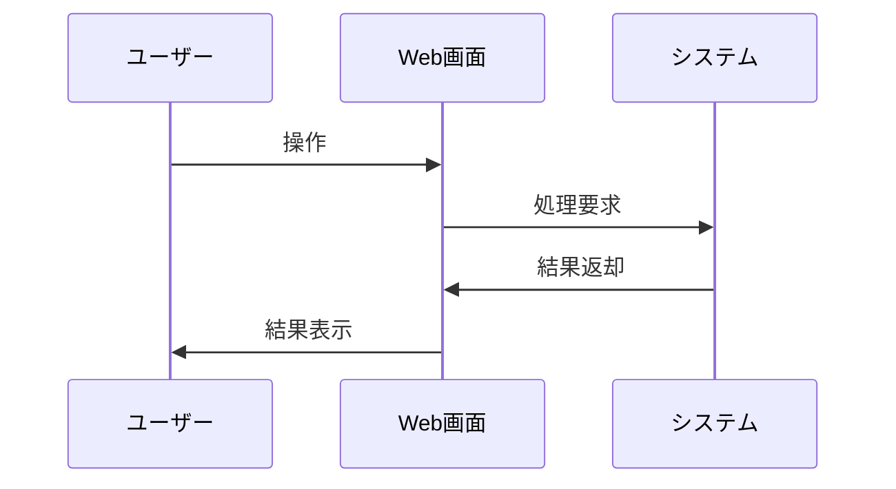

# Requirements Doc Format

## 目的

通常の要件定義書を v5 標準フォーマットで作成・修正・監査する。

## 必須方針

- ユーザーが別言語を明示しない限り、日本語で回答する。
- 対象 repository に要件定義書を作成・修正する場合は、既存 docs とプロトタイプを確認し、ローカルの用語・フォルダ構成に合わせる。
- 番号付き docs 構成では、`001` を prototyping として扱う。
  - `docs/001_プロトタイピング/` または `docs/001_prototyping/` はプロトタイプ用フォルダ。
  - UI/UX と画面遷移の Source of Truth はプロトタイプ。
  - 要件定義書は通常 `docs/002_要件定義書/` または `docs/002_requirements/` に置く。
- 実際の repository がそうなっていない限り、`001` を要件定義、`002` をプロトタイプとして扱う例示をしない。

## 作業手順

1. 文書種別を分類する。
   - 通常の要件定義書: この skill の標準フォーマットを適用する。
   - `*_spec.md`、非機能要件、`000_*` の概要文書、廃止・統合済みメモ: 通常の要件定義書とは分けて扱う。
2. 対象機能の既存資料を確認する。
   - 近い要件定義フォルダとプロトタイプフォルダを確認する。
   - 日本語名、英語名、独自命名のどれを使っているかを見る。
3. 通常の要件定義書には標準章立てを適用する。
4. 補助章は、複数機能にまたがる共通仕様の重複や曖昧さを避ける場合だけ追加する。
5. 最後にチェックリストで確認する。

## サンプル

具体例が必要な場合は、対象機能に近い `references/` だけを読む。複数パターンにまたがる場合は、該当するサンプルを複数読む。サンプル内の名称や項目はそのまま流用せず、対象 repository の用語に置き換える。

| 対象パターン | 参照ファイル |
| --- | --- |
| 認証、アカウントロック、初回パスワード変更 | `references/sample-login-requirements.md` |
| 一覧表示、検索、条件クリア、ページング、詳細遷移 | `references/sample-list-screen-requirements.md` |
| 詳細表示、編集開始、保存、キャンセル、排他制御 | `references/sample-detail-edit-requirements.md` |
| 作成、編集、削除、無効化/有効化、関連データ存在時の削除制御 | `references/sample-crud-master-requirements.md` |
| CSV一括取込、プレビュー、検証、一括作成/更新、結果出力 | `references/sample-bulk-import-requirements.md` |
| ファイル出力、対象件数確認、CSV仕様の補助章 | `references/sample-file-export-requirements.md` |
| 申請、承認、差戻し、取消、状態遷移 | `references/sample-approval-workflow-requirements.md` |

## Source of Truth

| カテゴリ | 正とするもの |
| --- | --- |
| UI/UX（見た目・操作感） | プロトタイプ |
| 画面遷移 | プロトタイプ |
| ビジネスロジック | 要件定義 |
| データ仕様 | 要件定義 |
| バリデーション | 要件定義 |
| エラーハンドリング | 要件定義 |

矛盾がある場合、UI/UX と画面遷移はプロトタイプを優先し、ロジック・データ・バリデーション・エラーは要件定義を優先する。判断できない場合は、勝手に決めずに曖昧点として明示する。

## 通常の要件定義書の標準章立て

通常の要件定義書は以下に統一する。

```md
# XXXの要件

## 1. 概要

## 2. 処理フロー

## 3. 機能要件

## 改定履歴
```

ルール:

- `# XXXの要件` は必須。
- `## 1. 概要` は必須。
- `## 2. 処理フロー` は必須。単機能でも、ユーザー操作とシステム応答が分かる最小の mermaid を書く。
- `## 3. 機能要件` は必須。
- `## 改定履歴` は必須。初版でも書く。

## 概要セクション

`## 1. 概要` は以下の構成にする。

```md
## 1. 概要

### 1.1 目的

### 1.2 機能一覧

### 1.3 用語定義

### 1.4 想定利用者
```

ルール:

- `1.1 目的`: 必須。この文書が対象とする機能・領域が何を実現するか 1 文で書く。
- `1.2 機能一覧`: 必須。本書で扱う機能を列挙する。
- `1.3 用語定義`: 複数機能で使う用語、状態、区分、権限、業務用語がある場合に書く。
- `1.4 想定利用者`: ロール、権限、操作範囲に差がある場合に書く。

## 処理フロー

`## 2. 処理フロー` は必須。mermaid で書く。

````md
## 2. 処理フロー


````

最低限含めるもの:

- ユーザーの主要操作
- システム側の主要処理
- 正常系の結果
- 理解に必要な代表的異常系分岐

機能間の大きな流れはこの章に集約する。個別機能の中に「次に 3.X へ進む」のようなフロー記述を分散しない。

## 機能要件

`## 3. 機能要件` 配下の各機能は、必ず以下の 4 観点をこの順で書く。

```md
### 3.X 機能名

（機能の目的を 1 文で）

#### 条件

#### 入力

#### 処理

#### 出力
```

### 条件

`基本情報` と `前提条件` で構成する。

```md
#### 条件

**基本情報**

| 項目 | 内容 |
| --- | --- |
| 実行者 | |
| トリガー | |

**前提条件**

| 条件 | 満たさない場合 |
| --- | --- |
```

ルール:

- `基本情報` は必須。
- `実行者` と `トリガー` は必ず書く。
- `前提条件` がない場合は、空テーブルではなく `なし` と書く。
- 権限制御がある場合は、`実行者` または `前提条件` に権限を明記する。
- 前提条件には、満たさない場合の影響も書く。

### 入力

入力データの仕様を書く。

```md
#### 入力

| 項目 | 型・形式 | 必須 | 制約 |
| --- | --- | --- | --- |
```

ルール:

- 原則として `項目 / 型・形式 / 必須 / 制約` の列で書く。
- 必須は `○`、任意は `-` で表す。
- デフォルト値が重要な場合は `デフォルト値` 列を追加してよい。
- 入力がない場合は `なし` と書く。
- バリデーションロジックは `入力` ではなく `処理` に書く。

### 処理

番号付きステップで書く。

```md
#### 処理

1. 〇〇を検証する
2. △△の場合、□□を実行する
3. ◇◇を保存する
```

ルール:

- 番号付きリストで書く。
- 各ステップは動作が分かる表現で始める。
- 条件分岐は `〇〇の場合、` で明示する。
- バリデーションロジックはここに含める。
- 必要なら `単項目チェック`、`複合チェック` などの小見出しで分類する。

### 出力

`正常系`、`異常系`、`境界値` に分ける。

```md
#### 出力

##### 正常系

| 状態変化 | ユーザーへの通知 |
| --- | --- |

##### 異常系

| エラー条件 | 通知 | 表示位置 |
| --- | --- | --- |

##### 境界値

| ケース | 扱い |
| --- | --- |
```

ルール:

- `正常系`、`異常系`、`境界値` は必ず置く。
- 該当内容がない場合は `なし` と書く。
- 正常系には状態変化とユーザー通知を書く。
- 異常系にはエラー条件、通知、表示位置を書く。
- 境界値には QA 観点で確認すべき閾値と扱いを書く。

## 補助章

補助章は標準章ではない。原則として作らない。

ただし、以下のように、機能要件だけでは重複や曖昧さが出る共通仕様は補助章にしてよい。

- 複数機能にまたがる認証・認可
- 複数機能で共有するステータス、状態、区分、ロック条件
- ファイル出力や外部連携の共通フォーマット
- 複数機能で使うルール定義や判定条件

補助章は `## 3. 機能要件` の後、`## 改定履歴` の前に置く。

```md
## 4. セキュリティ仕様
## 5. ステータス定義
## 改定履歴
```

DB 物理項目、API 詳細、1 機能内だけの項目説明、画面レイアウト詳細を整理する目的では補助章を作らない。補助章は要件定義を読むための前提に限定する。

## 書かないもの

通常の要件定義書には以下を書かない。

| セクション | 理由 |
| --- | --- |
| 提供する価値 | 抽象的で網羅性がない。機能一覧で代替する |
| 関連ドキュメント | メンテナンスが困難 |
| 付録: 境界の宣言 | 出力の境界値で扱う |
| URL パラメータ仕様 | 詳細設計の範囲 |
| API 仕様 | 詳細設計の範囲 |
| DB 物理設計 | DB 設計の範囲 |
| 画面レイアウト詳細 | プロトタイプまたは画面設計の範囲 |

URL パラメータから値を受け取ること自体は、入力や前提条件として書いてよい。ただし、ルート名、パラメータ名、API パスの詳細は、ユーザーが詳細設計を求めていない限り書かない。

## 改定履歴

以下の形式で書く。

```md
## 改定履歴

- 初版: YYYY/MM/DD
- YYYY/MM/DD
  - 変更内容
```

## チェックリスト

完了前に確認する。

- 文書種別を正しく分類したか。
- 通常の要件定義書に、タイトル、概要、処理フロー、機能要件、改定履歴があるか。
- 各機能が `条件 → 入力 → 処理 → 出力` の順になっているか。
- 前提条件、入力、異常系、境界値が空の場合に `なし` と書いているか。
- 補助章は共有要件を理解するために必要な場合だけ追加しているか。
- ファイルを配置する場合、プロトタイプと要件定義のパスが対象 repo の実際のフォルダ構成に合っているか。
