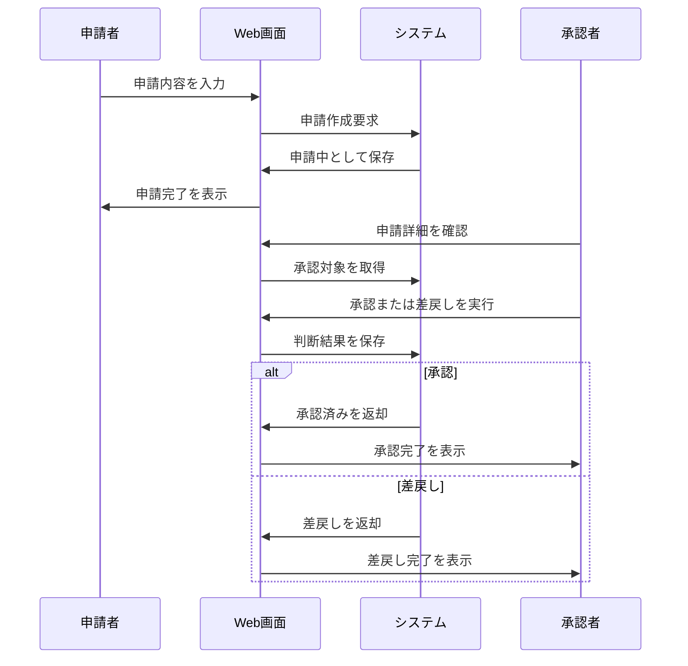

# 申請承認ワークフローの要件

## 1. 概要

### 1.1 目的

利用者が申請を作成し、承認者が申請内容を承認または差戻しできるようにする。

### 1.2 機能一覧

- 申請作成
- 申請取消
- 承認
- 差戻し
- 申請状態確認

### 1.3 用語定義

| 用語 | 説明 |
| --- | --- |
| 申請 | 承認を必要とする業務上の依頼 |
| 申請者 | 申請を作成・取消するユーザー |
| 承認者 | 申請を承認または差戻しするユーザー |
| 下書き | 申請前に申請者が編集できる状態 |
| 申請中 | 承認者の判断待ちの状態 |
| 承認済み | 承認者が承認した状態 |
| 差戻し | 承認者が申請者へ修正を求めた状態 |
| 取消済み | 申請者が申請を取り下げた状態 |

### 1.4 想定利用者

| 種別 | 説明 | 操作範囲 |
| --- | --- | --- |
| 申請者 | 申請を作成するユーザー | 作成、取消、状態確認 |
| 承認者 | 申請を判断するユーザー | 承認、差戻し、状態確認 |
| 管理者 | ワークフロー全体を確認するユーザー | 状態確認 |

---

## 2. 処理フロー

---

## 3. 機能要件

### 3.1 申請作成機能

申請者が必要事項を入力して申請を作成する。

#### 条件

**基本情報**

| 項目 | 内容 |
| --- | --- |
| 実行者 | 申請権限を持つ認証済みユーザー |
| トリガー | 申請ボタン押下 |

**前提条件**

| 条件 | 満たさない場合 |
| --- | --- |
| ユーザーが認証済みである | ログイン画面へ遷移 |
| 申請権限がある | 権限エラーを表示 |
| 申請内容が作成可能な状態である | 申請不可理由を表示 |

#### 入力

| 項目 | 型・形式 | 必須 | 制約 |
| --- | --- | --- | --- |
| 申請種別 | 選択値 | ○ | 定義済み申請種別から選択 |
| 件名 | 文字列 | ○ | 1〜100文字 |
| 申請内容 | 文字列 | ○ | 1〜2,000文字 |
| 承認者 | ユーザー選択 | ○ | 承認権限を持つユーザー |

#### 処理

1. 必須項目の入力有無を検証する
2. 件名と申請内容の文字数を検証する
3. 承認者が承認権限を持つことを確認する
4. 申請者と承認者の組み合わせが許可されることを確認する
5. 申請を申請中として保存する
6. 申請履歴を記録する
7. 承認者が確認できる状態にする

#### 出力

##### 正常系

| 状態変化 | ユーザーへの通知 |
| --- | --- |
| 申請が申請中になる | 「申請しました」 |
| 申請履歴が記録される | なし |

##### 異常系

| エラー条件 | 通知 | 表示位置 |
| --- | --- | --- |
| 件名未入力 | 「件名を入力してください」 | フィールド下 |
| 申請内容未入力 | 「申請内容を入力してください」 | フィールド下 |
| 承認者未指定 | 「承認者を選択してください」 | フィールド下 |
| 承認者に権限がない | 「選択したユーザーは承認者に指定できません」 | フィールド下 |
| 申請作成失敗 | 「申請できませんでした」 | 画面上部 |

##### 境界値

| ケース | 扱い |
| --- | --- |
| 件名1文字 | 正常 |
| 件名100文字 | 正常 |
| 件名101文字 | 異常 |
| 申請内容2,000文字 | 正常 |
| 申請内容2,001文字 | 異常 |

---

### 3.2 申請取消機能

申請者が申請中の申請を取り消す。

#### 条件

**基本情報**

| 項目 | 内容 |
| --- | --- |
| 実行者 | 申請者 |
| トリガー | 取消確認ダイアログの取消ボタン押下 |

**前提条件**

| 条件 | 満たさない場合 |
| --- | --- |
| 対象申請が存在する | 存在しない旨を表示 |
| 対象申請の申請者本人である | 権限エラーを表示 |
| 対象申請が申請中である | 取消不可理由を表示 |

#### 入力

| 項目 | 型・形式 | 必須 | 制約 |
| --- | --- | --- | --- |
| 対象申請ID | 文字列または数値 | ○ | 存在する申請を特定できること |
| 取消理由 | 文字列 | - | 500文字以内 |

#### 処理

1. 対象申請の存在を確認する
2. 申請者本人であることを確認する
3. 対象申請が申請中であることを確認する
4. 取消理由の文字数を検証する
5. 申請状態を取消済みに変更する
6. 申請履歴を記録する

#### 出力

##### 正常系

| 状態変化 | ユーザーへの通知 |
| --- | --- |
| 申請が取消済みになる | 「申請を取り消しました」 |

##### 異常系

| エラー条件 | 通知 | 表示位置 |
| --- | --- | --- |
| 申請者本人ではない | 「この申請は取り消せません」 | 画面上部 |
| 申請中ではない | 「現在の状態では取消できません」 | 画面上部 |
| 取消理由が500文字を超える | 「取消理由は500文字以内で入力してください」 | フィールド下 |

##### 境界値

| ケース | 扱い |
| --- | --- |
| 取消理由空 | 正常 |
| 取消理由500文字 | 正常 |
| 取消理由501文字 | 異常 |

---

### 3.3 承認機能

承認者が申請中の申請を承認する。

#### 条件

**基本情報**

| 項目 | 内容 |
| --- | --- |
| 実行者 | 承認者 |
| トリガー | 承認確認ダイアログの承認ボタン押下 |

**前提条件**

| 条件 | 満たさない場合 |
| --- | --- |
| 対象申請が存在する | 存在しない旨を表示 |
| 対象申請の承認者である | 権限エラーを表示 |
| 対象申請が申請中である | 承認不可理由を表示 |

#### 入力

| 項目 | 型・形式 | 必須 | 制約 |
| --- | --- | --- | --- |
| 対象申請ID | 文字列または数値 | ○ | 存在する申請を特定できること |
| 承認コメント | 文字列 | - | 500文字以内 |

#### 処理

1. 対象申請の存在を確認する
2. 承認者本人であることを確認する
3. 対象申請が申請中であることを確認する
4. 承認コメントの文字数を検証する
5. 申請状態を承認済みに変更する
6. 承認日時と承認者を記録する
7. 申請履歴を記録する

#### 出力

##### 正常系

| 状態変化 | ユーザーへの通知 |
| --- | --- |
| 申請が承認済みになる | 「承認しました」 |
| 承認情報が記録される | なし |

##### 異常系

| エラー条件 | 通知 | 表示位置 |
| --- | --- | --- |
| 承認者本人ではない | 「この申請は承認できません」 | 画面上部 |
| 申請中ではない | 「現在の状態では承認できません」 | 画面上部 |
| 承認コメントが500文字を超える | 「コメントは500文字以内で入力してください」 | フィールド下 |

##### 境界値

| ケース | 扱い |
| --- | --- |
| 承認コメント空 | 正常 |
| 承認コメント500文字 | 正常 |
| 承認コメント501文字 | 異常 |

---

### 3.4 差戻し機能

承認者が申請中の申請を差し戻す。

#### 条件

**基本情報**

| 項目 | 内容 |
| --- | --- |
| 実行者 | 承認者 |
| トリガー | 差戻しボタン押下 |

**前提条件**

| 条件 | 満たさない場合 |
| --- | --- |
| 対象申請が存在する | 存在しない旨を表示 |
| 対象申請の承認者である | 権限エラーを表示 |
| 対象申請が申請中である | 差戻し不可理由を表示 |

#### 入力

| 項目 | 型・形式 | 必須 | 制約 |
| --- | --- | --- | --- |
| 対象申請ID | 文字列または数値 | ○ | 存在する申請を特定できること |
| 差戻し理由 | 文字列 | ○ | 1〜500文字 |

#### 処理

1. 対象申請の存在を確認する
2. 承認者本人であることを確認する
3. 対象申請が申請中であることを確認する
4. 差戻し理由の入力有無と文字数を検証する
5. 申請状態を差戻しに変更する
6. 差戻し理由と差戻し者を記録する
7. 申請履歴を記録する

#### 出力

##### 正常系

| 状態変化 | ユーザーへの通知 |
| --- | --- |
| 申請が差戻しになる | 「差し戻しました」 |

##### 異常系

| エラー条件 | 通知 | 表示位置 |
| --- | --- | --- |
| 差戻し理由未入力 | 「差戻し理由を入力してください」 | フィールド下 |
| 差戻し理由が500文字を超える | 「差戻し理由は500文字以内で入力してください」 | フィールド下 |
| 申請中ではない | 「現在の状態では差戻しできません」 | 画面上部 |

##### 境界値

| ケース | 扱い |
| --- | --- |
| 差戻し理由1文字 | 正常 |
| 差戻し理由500文字 | 正常 |
| 差戻し理由501文字 | 異常 |

---

### 3.5 申請状態確認機能

申請者、承認者、管理者が申請状態と履歴を確認する。

#### 条件

**基本情報**

| 項目 | 内容 |
| --- | --- |
| 実行者 | 申請を参照できる認証済みユーザー |
| トリガー | 申請詳細画面へのアクセス |

**前提条件**

| 条件 | 満たさない場合 |
| --- | --- |
| 対象申請が存在する | 存在しない旨を表示 |
| 申請を参照する権限がある | 権限エラーを表示 |

#### 入力

| 項目 | 型・形式 | 必須 | 制約 |
| --- | --- | --- | --- |
| 対象申請ID | 文字列または数値 | ○ | 存在する申請を特定できること |

#### 処理

1. 対象申請の存在を確認する
2. 参照権限を確認する
3. 申請内容を取得する
4. 申請履歴を取得する
5. 実行者と現在状態に応じて利用可能な操作を判定する

#### 出力

##### 正常系

| 状態変化 | ユーザーへの通知 |
| --- | --- |
| 申請状態と履歴が表示される | なし |

##### 異常系

| エラー条件 | 通知 | 表示位置 |
| --- | --- | --- |
| 対象申請が存在しない | 「申請が見つかりません」 | 画面上部 |
| 参照権限がない | 「この申請を参照する権限がありません」 | 画面上部 |

##### 境界値

| ケース | 扱い |
| --- | --- |
| 履歴1件 | 正常に表示する |
| 履歴100件 | 正常に表示する |

## 4. 状態遷移

| 現在状態 | 操作 | 次状態 | 操作可能者 |
| --- | --- | --- | --- |
| 下書き | 申請 | 申請中 | 申請者 |
| 申請中 | 承認 | 承認済み | 承認者 |
| 申請中 | 差戻し | 差戻し | 承認者 |
| 申請中 | 取消 | 取消済み | 申請者 |
| 差戻し | 再申請 | 申請中 | 申請者 |

## 改定履歴

- 初版: YYYY/MM/DD
