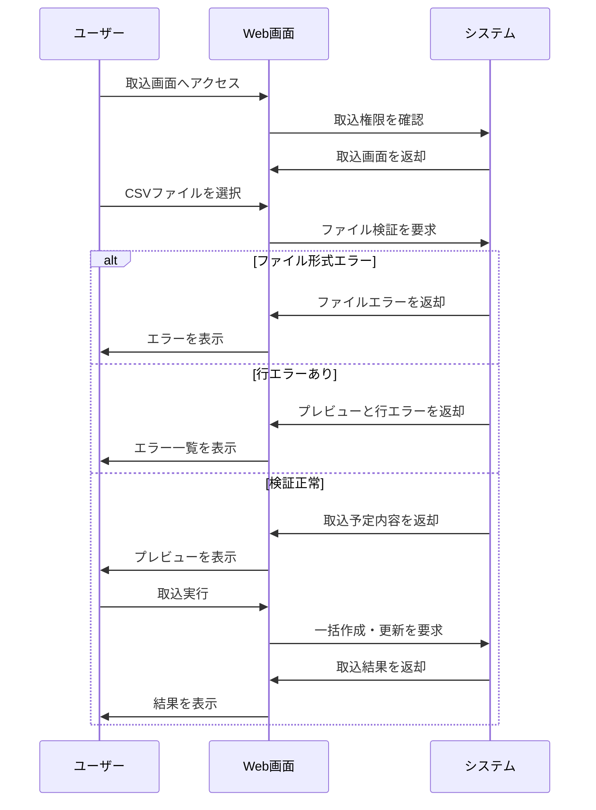

# データ一括取込機能の要件

## 1. 概要

### 1.1 目的

利用者がCSVファイルを使って複数件のデータを一括で作成または更新できるようにする。

### 1.2 機能一覧

- 取込ファイル選択
- 取込内容プレビュー
- 取込実行
- 取込結果出力

### 1.3 用語定義

| 用語 | 説明 |
| --- | --- |
| 取込 | ファイル内容を読み取り、システム上のデータとして登録または更新すること |
| プレビュー | 登録前に検証結果と取込予定内容を表示すること |
| 行エラー | ファイル内の特定行に対する検証エラー |
| 一括作成 | ファイル内の新規データをまとめて作成すること |
| 一括更新 | ファイル内の既存データをまとめて更新すること |

### 1.4 想定利用者

| 種別 | 説明 | 操作範囲 |
| --- | --- | --- |
| 一般利用者 | 自身の権限範囲のデータを取り込むユーザー | ファイル選択、プレビュー、取込実行、結果確認 |
| 管理者 | 全体のデータを管理するユーザー | すべての参照可能範囲の取込 |

---

## 2. 処理フロー

---

## 3. 機能要件

### 3.1 取込ファイル選択機能

取込対象のCSVファイルを選択する。

#### 条件

**基本情報**

| 項目 | 内容 |
| --- | --- |
| 実行者 | 取込権限を持つ認証済みユーザー |
| トリガー | ファイル選択またはアップロードボタン押下 |

**前提条件**

| 条件 | 満たさない場合 |
| --- | --- |
| ユーザーが認証済みである | ログイン画面へ遷移 |
| 取込権限がある | 権限エラーを表示 |

#### 入力

| 項目 | 型・形式 | 必須 | 制約 |
| --- | --- | --- | --- |
| 取込ファイル | CSVファイル | ○ | UTF-8、ヘッダー行あり、10MB以内 |

#### 処理

1. ファイルが選択されていることを確認する
2. ファイル拡張子とMIMEタイプを確認する
3. ファイルサイズが上限以内であることを確認する
4. 文字コードを確認する
5. ヘッダー行が定義と一致することを確認する
6. ファイル内容をプレビュー検証へ渡す

#### 出力

##### 正常系

| 状態変化 | ユーザーへの通知 |
| --- | --- |
| ファイルが検証対象になる | プレビュー検証を開始 |

##### 異常系

| エラー条件 | 通知 | 表示位置 |
| --- | --- | --- |
| ファイル未選択 | 「ファイルを選択してください」 | ファイル選択欄 |
| CSV以外 | 「CSVファイルを選択してください」 | ファイル選択欄 |
| サイズ上限超過 | 「ファイルサイズは10MB以内にしてください」 | ファイル選択欄 |
| ヘッダー不一致 | 「ファイルのヘッダーが正しくありません」 | 画面上部 |

##### 境界値

| ケース | 扱い |
| --- | --- |
| 0バイト | 異常 |
| 10MB | 正常 |
| 10MB超 | 異常 |

---

### 3.2 取込内容プレビュー機能

CSV内容を検証し、取込予定内容とエラーを表示する。

#### 条件

**基本情報**

| 項目 | 内容 |
| --- | --- |
| 実行者 | 取込権限を持つ認証済みユーザー |
| トリガー | ファイル選択後の検証開始 |

**前提条件**

| 条件 | 満たさない場合 |
| --- | --- |
| ファイル形式検証が正常である | ファイルエラーを表示 |

#### 入力

| 項目 | 型・形式 | 必須 | 制約 |
| --- | --- | --- | --- |
| CSV行データ | テキスト | ○ | 1〜5,000行 |

#### 処理

1. CSVを行単位で読み込む
2. 必須項目の入力有無を検証する
3. 各項目の形式、文字数、選択値を検証する
4. 参照先データが必要な場合、存在と参照権限を確認する
5. 一意制約がある項目のファイル内重複を確認する
6. 既存データと照合し、作成対象または更新対象に分類する
7. 行ごとの検証結果を作成する
8. 取込実行可否を判定する

#### 出力

##### 正常系

| 状態変化 | ユーザーへの通知 |
| --- | --- |
| 取込予定内容が表示される | 作成予定件数、更新予定件数、エラー件数を表示 |

##### 異常系

| エラー条件 | 通知 | 表示位置 |
| --- | --- | --- |
| 必須項目未入力 | 行番号と対象項目にエラーを表示 | エラー一覧 |
| 形式不正 | 行番号と対象項目にエラーを表示 | エラー一覧 |
| ファイル内重複 | 重複行を表示 | エラー一覧 |
| 参照不可データ指定 | 行番号と対象項目にエラーを表示 | エラー一覧 |

##### 境界値

| ケース | 扱い |
| --- | --- |
| 1行 | 正常に検証する |
| 5,000行 | 正常に検証する |
| 5,001行 | 行数上限超過として異常 |
| エラー0件 | 取込実行可能 |
| エラー1件 | 取込実行不可 |

---

### 3.3 取込実行機能

プレビューで検証済みの内容を一括で作成または更新する。

#### 条件

**基本情報**

| 項目 | 内容 |
| --- | --- |
| 実行者 | 取込権限を持つ認証済みユーザー |
| トリガー | 取込実行ボタン押下 |

**前提条件**

| 条件 | 満たさない場合 |
| --- | --- |
| プレビュー検証が完了している | 取込実行不可 |
| 行エラーが0件である | 取込実行不可 |
| 取込処理中でない | ボタンを非活性にする |

#### 入力

| 項目 | 型・形式 | 必須 | 制約 |
| --- | --- | --- | --- |
| 検証済み取込データ | 一時データ | ○ | プレビュー時点から改ざんされていないこと |

#### 処理

1. プレビュー結果が有効であることを確認する
2. 取込権限を再確認する
3. 行エラーが0件であることを確認する
4. 作成対象データを登録する
5. 更新対象データを更新する
6. 取込件数と結果を記録する
7. 取込後の一覧または結果画面を更新する

#### 出力

##### 正常系

| 状態変化 | ユーザーへの通知 |
| --- | --- |
| 対象データが一括作成または更新される | 「取込が完了しました」 |
| 取込結果が記録される | 作成件数、更新件数を表示 |

##### 異常系

| エラー条件 | 通知 | 表示位置 |
| --- | --- | --- |
| プレビュー結果が期限切れ | 「再度ファイルを選択してください」 | 画面上部 |
| 取込中に競合が発生 | 「一部データが更新されています。再検証してください」 | 画面上部 |
| 取込失敗 | 「取込できませんでした」 | 画面上部 |

##### 境界値

| ケース | 扱い |
| --- | --- |
| 作成0件・更新1件 | 正常 |
| 作成1件・更新0件 | 正常 |
| 作成5,000件・更新0件 | 正常 |

---

### 3.4 取込結果出力機能

取込結果とエラー内容をファイルとして出力する。

#### 条件

**基本情報**

| 項目 | 内容 |
| --- | --- |
| 実行者 | 取込画面を利用中のユーザー |
| トリガー | 結果ダウンロードボタン押下 |

**前提条件**

| 条件 | 満たさない場合 |
| --- | --- |
| プレビュー結果または取込結果が存在する | ボタンを非活性にする |

#### 入力

| 項目 | 型・形式 | 必須 | 制約 |
| --- | --- | --- | --- |
| 出力対象 | 選択値 | ○ | 検証結果、取込結果 |

#### 処理

1. 出力対象の結果データを取得する
2. 行番号、処理区分、結果、エラー内容を整形する
3. CSVファイルを生成する
4. ファイル名を生成する
5. ダウンロードを開始する

#### 出力

##### 正常系

| 状態変化 | ユーザーへの通知 |
| --- | --- |
| 結果ファイルが生成される | ファイルをダウンロード |

##### 異常系

| エラー条件 | 通知 | 表示位置 |
| --- | --- | --- |
| 結果データが存在しない | 「出力する結果がありません」 | 画面上部 |
| ファイル生成失敗 | 「結果ファイルを生成できませんでした」 | 画面上部 |

##### 境界値

| ケース | 扱い |
| --- | --- |
| 結果1件 | CSVを生成する |
| 結果5,000件 | CSVを生成する |

## 4. 取込ファイル仕様

| 項目 | 内容 |
| --- | --- |
| 文字コード | UTF-8 |
| 区切り文字 | カンマ |
| ヘッダー行 | 必須 |
| 最大行数 | 5,000行 |
| 最大ファイルサイズ | 10MB |
| 取込単位 | エラーが1件でもある場合は実行不可 |

## 改定履歴

- 初版: YYYY/MM/DD
