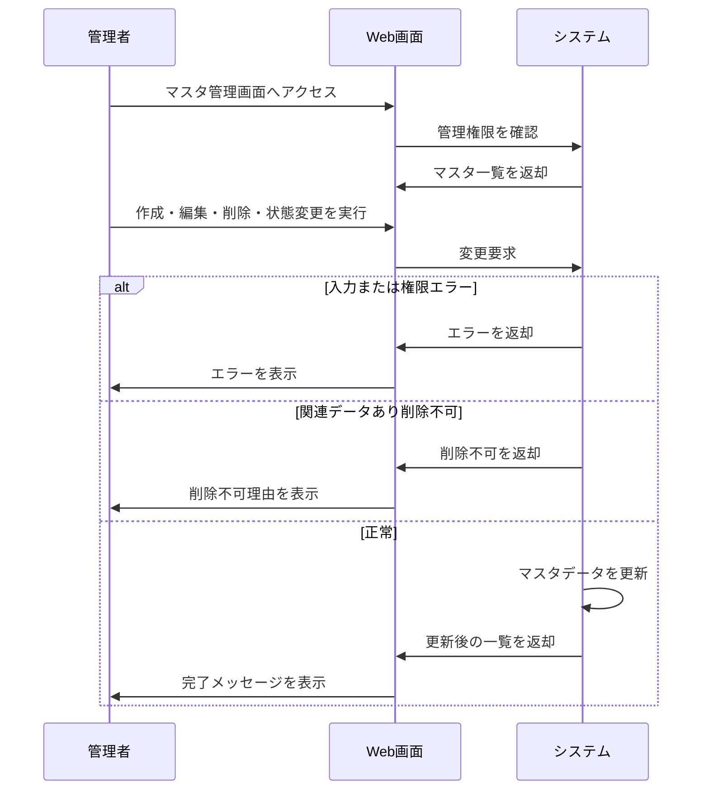

# マスタデータ管理の要件

## 1. 概要

### 1.1 目的

管理者が業務で利用するマスタデータを作成・編集・削除し、利用可能な状態を管理できるようにする。

### 1.2 機能一覧

- マスタデータ新規作成
- マスタデータ編集
- マスタデータ削除
- マスタデータ無効化・有効化

### 1.3 用語定義

| 用語 | 説明 |
| --- | --- |
| マスタデータ | 複数機能で参照される管理用データ |
| コード | マスタデータを一意に識別する値 |
| 有効 | 利用者が選択・参照できる状態 |
| 無効 | 既存データとの整合性を保ったまま新規利用を止めた状態 |
| 削除 | 以後の利用対象から除外する操作 |

### 1.4 想定利用者

| 種別 | 説明 | 操作範囲 |
| --- | --- | --- |
| 管理者 | マスタ管理権限を持つユーザー | 作成、編集、削除、無効化、有効化 |

---

## 2. 処理フロー

---

## 3. 機能要件

### 3.1 マスタデータ新規作成機能

新しいマスタデータを登録する。

#### 条件

**基本情報**

| 項目 | 内容 |
| --- | --- |
| 実行者 | マスタ管理権限を持つ管理者 |
| トリガー | 新規作成フォームの保存ボタン押下 |

**前提条件**

| 条件 | 満たさない場合 |
| --- | --- |
| 管理者が認証済みである | ログイン画面へ遷移 |
| マスタ作成権限がある | 権限エラーを表示 |

#### 入力

| 項目 | 型・形式 | 必須 | 制約 |
| --- | --- | --- | --- |
| コード | 半角英数字 | ○ | 1〜30文字、既存コードと重複不可 |
| 名称 | 文字列 | ○ | 1〜100文字 |
| 表示順 | 数値 | - | 1以上、未指定時は末尾 |
| ステータス | 選択値 | ○ | 有効、無効 |

#### 処理

1. 必須項目の入力有無を検証する
2. コードの形式と文字数を検証する
3. 名称の文字数を検証する
4. 表示順が指定されている場合、数値範囲を検証する
5. 同一コードのマスタデータが存在しないことを確認する
6. マスタデータを作成する
7. 操作履歴を記録する
8. 一覧を再取得する

#### 出力

##### 正常系

| 状態変化 | ユーザーへの通知 |
| --- | --- |
| マスタデータが作成される | 「作成しました」 |
| 操作履歴が記録される | なし |

##### 異常系

| エラー条件 | 通知 | 表示位置 |
| --- | --- | --- |
| コード未入力 | 「コードを入力してください」 | フィールド下 |
| コード形式不正 | 「コードは半角英数字で入力してください」 | フィールド下 |
| コード重複 | 「同じコードが既に存在します」 | フィールド下 |
| 名称未入力 | 「名称を入力してください」 | フィールド下 |
| 作成失敗 | 「作成できませんでした」 | 画面上部 |

##### 境界値

| ケース | 扱い |
| --- | --- |
| コード1文字 | 正常 |
| コード30文字 | 正常 |
| コード31文字 | 異常 |
| 名称100文字 | 正常 |
| 名称101文字 | 異常 |

---

### 3.2 マスタデータ編集機能

既存のマスタデータの内容を変更する。

#### 条件

**基本情報**

| 項目 | 内容 |
| --- | --- |
| 実行者 | マスタ管理権限を持つ管理者 |
| トリガー | 編集フォームの保存ボタン押下 |

**前提条件**

| 条件 | 満たさない場合 |
| --- | --- |
| 対象マスタデータが存在する | 存在しない旨を表示 |
| マスタ編集権限がある | 権限エラーを表示 |
| 他者に更新されていない | 競合エラーを表示 |

#### 入力

| 項目 | 型・形式 | 必須 | 制約 |
| --- | --- | --- | --- |
| 対象マスタID | 文字列または数値 | ○ | 存在するマスタデータを特定できること |
| 名称 | 文字列 | ○ | 1〜100文字 |
| 表示順 | 数値 | - | 1以上 |
| 更新確認情報 | 文字列または日時 | ○ | 表示時点の更新状態を識別できること |

#### 処理

1. 対象マスタデータの存在を確認する
2. 編集権限を確認する
3. 入力値の必須、形式、文字数を検証する
4. 更新確認情報を比較し、競合の有無を判定する
5. 変更内容を保存する
6. 操作履歴を記録する
7. 一覧または詳細を再取得する

#### 出力

##### 正常系

| 状態変化 | ユーザーへの通知 |
| --- | --- |
| マスタデータが更新される | 「保存しました」 |
| 操作履歴が記録される | なし |

##### 異常系

| エラー条件 | 通知 | 表示位置 |
| --- | --- | --- |
| 対象が存在しない | 「対象データが見つかりません」 | 画面上部 |
| 名称未入力 | 「名称を入力してください」 | フィールド下 |
| 他者に更新済み | 「他のユーザーにより更新されています」 | 画面上部 |
| 保存失敗 | 「保存できませんでした」 | 画面上部 |

##### 境界値

| ケース | 扱い |
| --- | --- |
| 名称1文字 | 正常 |
| 名称100文字 | 正常 |
| 名称101文字 | 異常 |

---

### 3.3 マスタデータ削除機能

不要になったマスタデータを削除する。

#### 条件

**基本情報**

| 項目 | 内容 |
| --- | --- |
| 実行者 | マスタ管理権限を持つ管理者 |
| トリガー | 削除確認ダイアログの削除ボタン押下 |

**前提条件**

| 条件 | 満たさない場合 |
| --- | --- |
| 対象マスタデータが存在する | 存在しない旨を表示 |
| マスタ削除権限がある | 権限エラーを表示 |
| 関連する業務データから参照されていない | 削除不可理由を表示 |

#### 入力

| 項目 | 型・形式 | 必須 | 制約 |
| --- | --- | --- | --- |
| 対象マスタID | 文字列または数値 | ○ | 存在するマスタデータを特定できること |
| 削除確認 | 真偽値 | ○ | ユーザーが明示的に確認していること |

#### 処理

1. 対象マスタデータの存在を確認する
2. 削除権限を確認する
3. 削除確認が行われていることを確認する
4. 関連する業務データから参照されていないことを確認する
5. 削除可能な場合、マスタデータを削除する
6. 操作履歴を記録する
7. 一覧から対象データを除外する

#### 出力

##### 正常系

| 状態変化 | ユーザーへの通知 |
| --- | --- |
| マスタデータが削除される | 「削除しました」 |
| 操作履歴が記録される | なし |

##### 異常系

| エラー条件 | 通知 | 表示位置 |
| --- | --- | --- |
| 削除確認がない | 「削除を確認してください」 | ダイアログ内 |
| 関連データから参照中 | 「関連データが存在するため削除できません」 | ダイアログ内 |
| 削除失敗 | 「削除できませんでした」 | 画面上部 |

##### 境界値

| ケース | 扱い |
| --- | --- |
| 関連データ0件 | 削除可能 |
| 関連データ1件 | 削除不可 |

---

### 3.4 マスタデータ無効化・有効化機能

マスタデータの利用可否を切り替える。

#### 条件

**基本情報**

| 項目 | 内容 |
| --- | --- |
| 実行者 | マスタ管理権限を持つ管理者 |
| トリガー | 状態変更ボタン押下 |

**前提条件**

| 条件 | 満たさない場合 |
| --- | --- |
| 対象マスタデータが存在する | 存在しない旨を表示 |
| 状態変更権限がある | 権限エラーを表示 |

#### 入力

| 項目 | 型・形式 | 必須 | 制約 |
| --- | --- | --- | --- |
| 対象マスタID | 文字列または数値 | ○ | 存在するマスタデータを特定できること |
| 変更後ステータス | 選択値 | ○ | 有効、無効 |

#### 処理

1. 対象マスタデータの存在を確認する
2. 状態変更権限を確認する
3. 現在ステータスと変更後ステータスが異なることを確認する
4. ステータスを更新する
5. 操作履歴を記録する
6. 一覧の表示状態を更新する

#### 出力

##### 正常系

| 状態変化 | ユーザーへの通知 |
| --- | --- |
| マスタデータのステータスが変更される | 「ステータスを変更しました」 |

##### 異常系

| エラー条件 | 通知 | 表示位置 |
| --- | --- | --- |
| 既に同じステータス | 「既に選択したステータスです」 | 画面上部 |
| 状態変更失敗 | 「ステータスを変更できませんでした」 | 画面上部 |

##### 境界値

| ケース | 扱い |
| --- | --- |
| 有効から無効 | 正常 |
| 無効から有効 | 正常 |

## 4. 共通制御

| 項目 | 内容 |
| --- | --- |
| 操作履歴 | 作成、編集、削除、状態変更の実行者、日時、対象、変更概要を記録する |
| 削除制御 | 関連データがある場合は削除せず、無効化を案内する |
| 重複制御 | 一意性が必要なコードは作成時に重複を許可しない |

## 改定履歴

- 初版: YYYY/MM/DD
