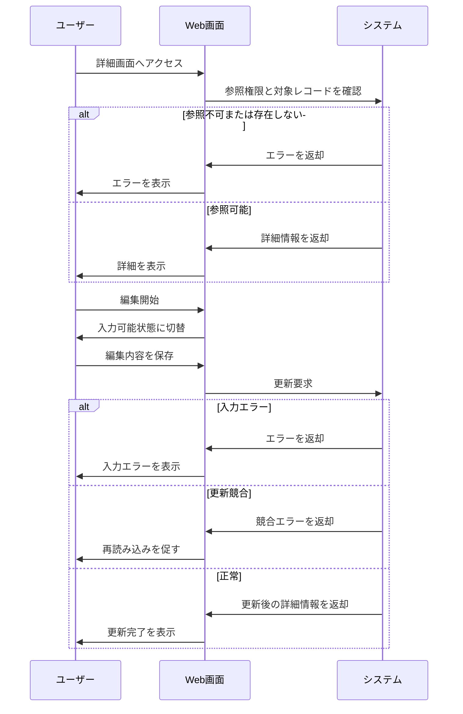

# レコード詳細編集画面の要件

## 1. 概要

### 1.1 目的

利用者が管理対象レコードの詳細を確認し、必要な項目を編集できるようにする。

### 1.2 機能一覧

- 詳細表示
- 編集開始
- 編集内容保存
- 編集キャンセル

### 1.3 用語定義

| 用語 | 説明 |
| --- | --- |
| 管理対象レコード | 利用者が参照・編集する業務データ |
| 編集中 | 利用者が詳細画面で入力値を変更できる状態 |
| 競合 | 他ユーザーまたは別セッションで同じレコードが先に更新された状態 |

### 1.4 想定利用者

| 種別 | 説明 | 操作範囲 |
| --- | --- | --- |
| 一般利用者 | 自身の権限範囲のデータを扱うユーザー | 詳細表示、編集、保存 |
| 管理者 | 全体のデータを管理するユーザー | 詳細表示、編集、保存 |

---

## 2. 処理フロー

---

## 3. 機能要件

### 3.1 詳細表示機能

対象レコードの詳細情報を表示する。

#### 条件

**基本情報**

| 項目 | 内容 |
| --- | --- |
| 実行者 | 認証済みユーザー |
| トリガー | 詳細画面へのアクセス |

**前提条件**

| 条件 | 満たさない場合 |
| --- | --- |
| ユーザーが認証済みである | ログイン画面へ遷移 |
| 対象レコードを参照する権限がある | 権限エラーを表示 |
| 対象レコードが存在する | 存在しない旨を表示 |

#### 入力

| 項目 | 型・形式 | 必須 | 制約 |
| --- | --- | --- | --- |
| 対象レコードID | 文字列または数値 | ○ | 存在するレコードを特定できること |

#### 処理

1. 対象レコードIDの指定有無を検証する
2. 認証状態を確認する
3. 対象レコードの参照権限を確認する
4. 対象レコードを取得する
5. 表示用項目へ整形する

#### 出力

##### 正常系

| 状態変化 | ユーザーへの通知 |
| --- | --- |
| 詳細情報が表示される | なし |

##### 異常系

| エラー条件 | 通知 | 表示位置 |
| --- | --- | --- |
| 対象レコードID未指定 | 「対象を特定できません」 | 画面上部 |
| 対象レコードが存在しない | 「対象データが見つかりません」 | 画面上部 |
| 参照権限がない | 「このデータを参照する権限がありません」 | 画面上部 |

##### 境界値

| ケース | 扱い |
| --- | --- |
| 最小IDのレコード | 正常に表示する |
| 最大IDのレコード | 正常に表示する |
| 削除済みレコード | 存在しない扱いにする |

---

### 3.2 編集開始機能

詳細画面を入力可能状態へ切り替える。

#### 条件

**基本情報**

| 項目 | 内容 |
| --- | --- |
| 実行者 | 編集権限を持つ認証済みユーザー |
| トリガー | 編集ボタン押下 |

**前提条件**

| 条件 | 満たさない場合 |
| --- | --- |
| 対象レコードが表示中である | 実行不可 |
| 対象レコードを編集する権限がある | 編集ボタンを表示しない |
| 対象レコードが編集可能な状態である | 編集不可メッセージを表示 |

#### 入力

なし

#### 処理

1. 編集権限を確認する
2. 対象レコードの状態を確認する
3. 編集可能項目を入力可能にする
4. 保存ボタンとキャンセルボタンを表示する

#### 出力

##### 正常系

| 状態変化 | ユーザーへの通知 |
| --- | --- |
| 画面が編集中になる | なし |

##### 異常系

| エラー条件 | 通知 | 表示位置 |
| --- | --- | --- |
| 編集権限がない | 「編集する権限がありません」 | 画面上部 |
| 対象レコードが編集不可状態 | 「現在このデータは編集できません」 | 画面上部 |

##### 境界値

なし

---

### 3.3 編集内容保存機能

入力された編集内容を対象レコードへ反映する。

#### 条件

**基本情報**

| 項目 | 内容 |
| --- | --- |
| 実行者 | 編集権限を持つ認証済みユーザー |
| トリガー | 保存ボタン押下 |

**前提条件**

| 条件 | 満たさない場合 |
| --- | --- |
| 画面が編集中である | 実行不可 |
| 対象レコードが編集可能な状態である | 編集不可エラーを表示 |
| 読み込み時から他者に更新されていない | 競合エラーを表示 |

#### 入力

| 項目 | 型・形式 | 必須 | 制約 |
| --- | --- | --- | --- |
| 名称 | 文字列 | ○ | 100文字以内 |
| 説明 | 文字列 | - | 1,000文字以内 |
| ステータス | 選択値 | ○ | 有効、停止 |
| 更新確認情報 | 文字列または日時 | ○ | 表示時点の更新状態を識別できること |

#### 処理

1. 必須項目の入力有無を検証する
2. 文字数と選択値の制約を検証する
3. 編集権限を再確認する
4. 対象レコードの現在状態を確認する
5. 更新確認情報を比較し、競合の有無を判定する
6. 編集内容を保存する
7. 更新後の詳細情報を再取得する

#### 出力

##### 正常系

| 状態変化 | ユーザーへの通知 |
| --- | --- |
| 対象レコードが更新される | 「保存しました」 |
| 画面が参照状態に戻る | 更新後の詳細を表示 |

##### 異常系

| エラー条件 | 通知 | 表示位置 |
| --- | --- | --- |
| 名称未入力 | 「名称を入力してください」 | フィールド下 |
| 名称が100文字を超える | 「名称は100文字以内で入力してください」 | フィールド下 |
| 説明が1,000文字を超える | 「説明は1,000文字以内で入力してください」 | フィールド下 |
| 他者に更新済み | 「他のユーザーにより更新されています。再読み込みしてください」 | 画面上部 |
| 保存失敗 | 「保存できませんでした」 | 画面上部 |

##### 境界値

| ケース | 扱い |
| --- | --- |
| 名称1文字 | 正常 |
| 名称100文字 | 正常 |
| 名称101文字 | 異常 |
| 説明1,000文字 | 正常 |
| 説明1,001文字 | 異常 |

---

### 3.4 編集キャンセル機能

編集中の入力内容を破棄して詳細表示へ戻る。

#### 条件

**基本情報**

| 項目 | 内容 |
| --- | --- |
| 実行者 | 編集中のユーザー |
| トリガー | キャンセルボタン押下 |

**前提条件**

| 条件 | 満たさない場合 |
| --- | --- |
| 画面が編集中である | 実行不可 |

#### 入力

なし

#### 処理

1. 未保存の入力内容を破棄する
2. エラー表示をクリアする
3. 保存前の詳細表示に戻す
4. 必要に応じて最新情報を再取得する

#### 出力

##### 正常系

| 状態変化 | ユーザーへの通知 |
| --- | --- |
| 編集内容が破棄される | なし |
| 画面が参照状態に戻る | 詳細情報を表示 |

##### 異常系

なし

##### 境界値

なし

## 改定履歴

- 初版: YYYY/MM/DD
