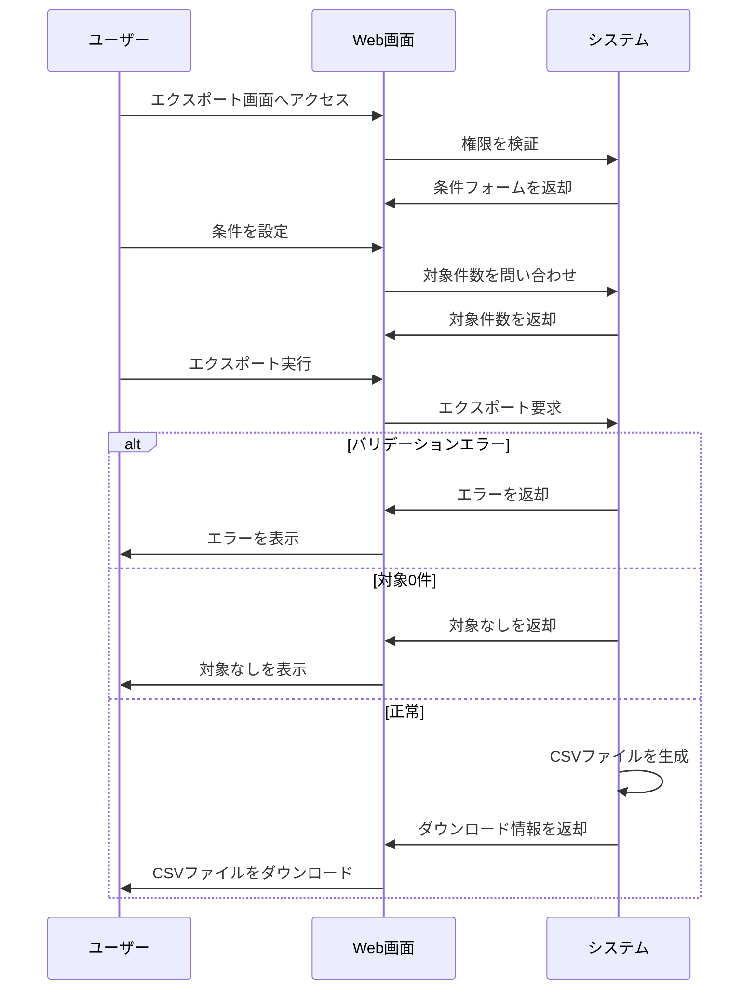

# データエクスポート機能の要件

## 1. 概要

### 1.1 目的

利用者が条件に一致する業務データをCSV形式で取得し、外部ツールで確認・加工できるようにする。

### 1.2 機能一覧

- エクスポート条件設定
- エクスポート対象件数表示
- エクスポート実行
- 条件リセット

### 1.3 用語定義

| 用語 | 説明 |
| --- | --- |
| エクスポート | 条件に一致するデータをファイルとして出力すること |
| 対象データ | エクスポート条件に一致する業務レコード |
| CSV | カンマ区切りのテキストファイル形式 |

### 1.4 想定利用者

| 種別 | 説明 | 操作範囲 |
| --- | --- | --- |
| 一般利用者 | 自身が参照可能なデータを扱うユーザー | 自身の参照範囲のエクスポート |
| 管理者 | 全体のデータを管理するユーザー | すべての参照可能データのエクスポート |

---

## 2. 処理フロー

---

## 3. 機能要件

### 3.1 エクスポート条件設定機能

エクスポート対象を限定する条件を設定できる。

#### 条件

**基本情報**

| 項目 | 内容 |
| --- | --- |
| 実行者 | 認証済みユーザー |
| トリガー | エクスポート画面へのアクセス |

**前提条件**

| 条件 | 満たさない場合 |
| --- | --- |
| ユーザーが認証済みである | ログイン画面へ遷移 |
| ユーザーにデータ出力権限がある | 権限エラーを表示 |

#### 入力

| 項目 | 型・形式 | 必須 | デフォルト値 | 制約 |
| --- | --- | --- | --- | --- |
| 開始日 | YYYY-MM-DD | - | 当月1日 | 終了日以前 |
| 終了日 | YYYY-MM-DD | - | 当日 | 開始日以後 |
| ステータス | 選択値 | - | すべて | 定義済みステータスから選択 |
| 部門 | 選択値 | - | ロールにより異なる | 参照可能な部門のみ |

#### 処理

1. ユーザーの参照可能範囲を取得する
2. 日付条件の初期値を設定する
3. ステータス選択肢を設定する
4. 部門選択肢を参照可能範囲に絞る
5. 条件変更時に対象件数を更新する

#### 出力

##### 正常系

| 状態変化 | ユーザーへの通知 |
| --- | --- |
| エクスポート条件が設定される | 「対象: X件」を表示 |

##### 異常系

| エラー条件 | 通知 | 表示位置 |
| --- | --- | --- |
| 開始日が終了日より後 | 「開始日は終了日以前の日付を指定してください」 | フィールド下 |

##### 境界値

| ケース | 扱い |
| --- | --- |
| 開始日と終了日が同日 | その日1日を対象にする |
| 日付条件が空 | 全期間を対象にする |
| 対象0件 | 「該当するデータがありません」を表示 |

---

### 3.2 エクスポート実行機能

条件に一致するデータをCSVファイルとしてダウンロードする。

#### 条件

**基本情報**

| 項目 | 内容 |
| --- | --- |
| 実行者 | 認証済みユーザー |
| トリガー | エクスポート実行ボタン押下 |

**前提条件**

| 条件 | 満たさない場合 |
| --- | --- |
| エクスポート処理中でない | ボタンを非活性にする |
| 対象件数が1件以上である | ボタンを非活性にする |
| 対象件数が上限以内である | 上限超過エラーを表示 |

#### 入力

| 項目 | 型・形式 | 必須 | 制約 |
| --- | --- | --- | --- |
| エクスポート条件 | 設定済み条件 | ○ | 参照可能範囲内であること |

#### 処理

1. エクスポート条件を検証する
2. 条件に一致する対象データを検索する
3. 対象件数が上限を超えていないか確認する
4. 対象データを出力項目の順に整形する
5. CSVファイルを生成する
6. ファイル名を生成する
7. ダウンロードを開始する

#### 出力

##### 正常系

| 状態変化 | ユーザーへの通知 |
| --- | --- |
| CSVファイルが生成される | ファイルをダウンロード |

##### 異常系

| エラー条件 | 通知 | 表示位置 |
| --- | --- | --- |
| 対象0件 | 「エクスポート対象がありません」 | 画面上部 |
| 対象件数が上限超過 | 「対象件数が多すぎます。条件を絞り込んでください」 | 画面上部 |
| ファイル生成失敗 | 「ファイルを生成できませんでした」 | 画面上部 |

##### 境界値

| ケース | 扱い |
| --- | --- |
| 対象1件 | CSVを生成する |
| 対象10,000件 | CSVを生成する |
| 対象10,001件 | 上限超過として異常 |

---

### 3.3 条件リセット機能

設定済み条件を初期値に戻す。

#### 条件

**基本情報**

| 項目 | 内容 |
| --- | --- |
| 実行者 | 認証済みユーザー |
| トリガー | 条件リセットボタン押下 |

**前提条件**

| 条件 | 満たさない場合 |
| --- | --- |
| エクスポート処理中でない | ボタンを非活性にする |

#### 入力

なし

#### 処理

1. 開始日を当月1日に戻す
2. 終了日を当日に戻す
3. ステータスをすべてに戻す
4. 部門を初期値に戻す
5. エラー表示をクリアする
6. 対象件数を再取得する

#### 出力

##### 正常系

| 状態変化 | ユーザーへの通知 |
| --- | --- |
| 条件が初期値に戻る | 対象件数を更新 |

##### 異常系

なし

##### 境界値

なし

---

## 4. CSVファイル仕様

### 4.1 基本仕様

| 項目 | 仕様 |
| --- | --- |
| 文字コード | UTF-8 |
| 改行コード | LF |
| 区切り文字 | カンマ |
| ヘッダー行 | あり |

### 4.2 ファイル名規則

| 項目 | 仕様 |
| --- | --- |
| ファイル名 | `export_YYYYMMDD_HHmmss.csv` |
| 日時 | エクスポート実行日時 |

### 4.3 列フォーマット

| 列名 | 型・形式 | 必須 | 説明 |
| --- | --- | --- | --- |
| レコードID | 文字列 | ○ | 対象データの識別子 |
| 発生日 | YYYY-MM-DD | ○ | 業務上の発生日 |
| ステータス | 文字列 | ○ | 対象データの状態 |
| 金額 | 整数 | - | 金額がない場合は空欄 |
| 備考 | 文字列 | - | 任意の補足 |

---

## 改定履歴

- 初版: YYYY/MM/DD
