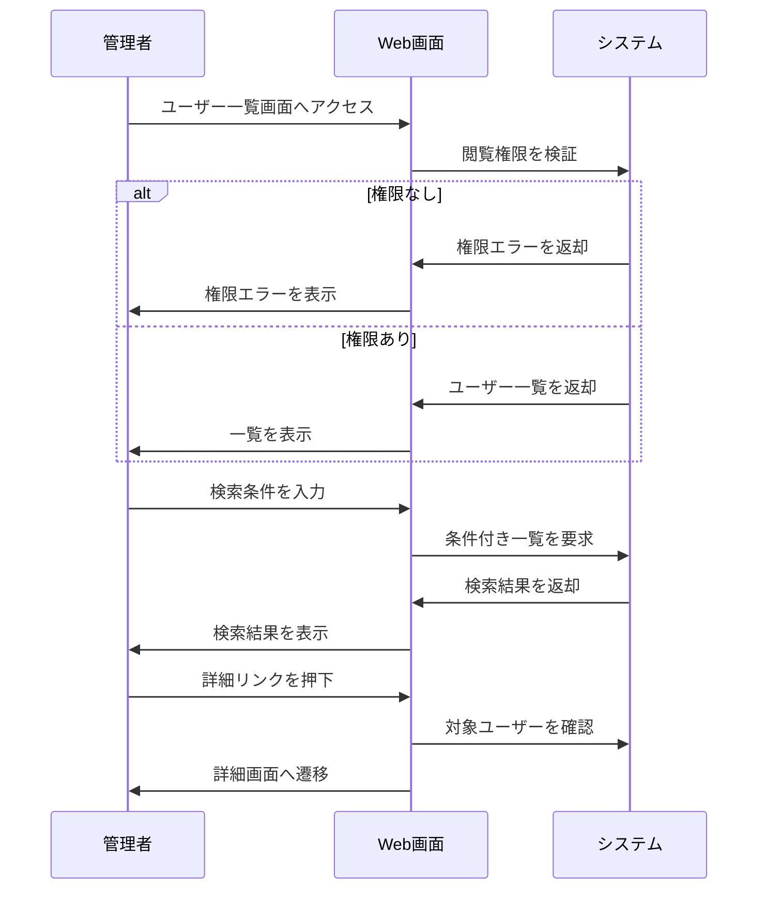

# ユーザー一覧画面の要件

## 1. 概要

### 1.1 目的

管理者が登録済みユーザーを検索・確認し、必要なユーザー詳細へ遷移できるようにする。

### 1.2 機能一覧

- ユーザー一覧表示
- キーワード検索
- ロール絞り込み
- 検索条件クリア
- ページング
- ユーザー詳細画面遷移

### 1.3 用語定義

| 用語 | 説明 |
| --- | --- |
| ユーザー | システムを利用する個人 |
| ロール | ユーザーに付与される操作権限の分類 |
| ステータス | ユーザーの利用状態。有効または停止 |

### 1.4 想定利用者

| 種別 | 説明 | 操作範囲 |
| --- | --- | --- |
| 管理者 | ユーザー管理権限を持つユーザー | 一覧表示、検索、詳細遷移 |

---

## 2. 処理フロー

---

## 3. 機能要件

### 3.1 ユーザー一覧表示機能

登録済みユーザーを一覧表示する。

#### 条件

**基本情報**

| 項目 | 内容 |
| --- | --- |
| 実行者 | 認証済みの管理者 |
| トリガー | ユーザー一覧画面へのアクセス |

**前提条件**

| 条件 | 満たさない場合 |
| --- | --- |
| ユーザーが認証済みである | ログイン画面へ遷移 |
| ユーザー管理の閲覧権限がある | 権限エラーを表示 |

#### 入力

なし

#### 処理

1. 初期検索条件を取得する
2. ユーザーを作成日時の降順で取得する
3. 1ページあたり20件でページングする
4. 一覧表示に必要な項目へ整形する

#### 出力

##### 正常系

| 状態変化 | ユーザーへの通知 |
| --- | --- |
| ユーザー一覧が表示される | なし |

表示項目:

| 列名 | 内容 |
| --- | --- |
| 氏名 | ユーザーの表示名 |
| メールアドレス | ログインに使用するメールアドレス |
| ロール | 付与されているロール |
| ステータス | 有効または停止 |
| 最終ログイン日時 | 最後にログインした日時 |
| アクション | 詳細画面へのリンク |

##### 異常系

| エラー条件 | 通知 | 表示位置 |
| --- | --- | --- |
| 一覧取得に失敗 | 「ユーザー一覧を取得できませんでした」 | 画面上部 |

##### 境界値

| ケース | 扱い |
| --- | --- |
| ユーザー0件 | 「ユーザーがありません」を表示 |
| ユーザー1件 | 1件のみ表示 |
| ユーザー20件 | 1ページに20件表示 |
| ユーザー21件 | 2ページに分割 |

---

### 3.2 検索・絞り込み機能

キーワードとロールでユーザーを絞り込む。

#### 条件

**基本情報**

| 項目 | 内容 |
| --- | --- |
| 実行者 | 認証済みの管理者 |
| トリガー | 検索ボタン押下またはEnterキー押下 |

**前提条件**

| 条件 | 満たさない場合 |
| --- | --- |
| ユーザー一覧画面を表示中である | 実行不可 |

#### 入力

| 項目 | 型・形式 | 必須 | 制約 |
| --- | --- | --- | --- |
| キーワード | 文字列 | - | 100文字以内 |
| ロール | 選択値 | - | 定義済みロールから選択 |
| ステータス | 選択値 | - | 有効、停止、すべて |

#### 処理

1. キーワードの前後空白を除去する
2. キーワードがある場合、氏名とメールアドレスを部分一致検索する
3. ロールが指定されている場合、対象ロールで絞り込む
4. ステータスが指定されている場合、対象ステータスで絞り込む
5. ページ番号を1に戻す
6. 絞り込み結果を取得する

#### 出力

##### 正常系

| 状態変化 | ユーザーへの通知 |
| --- | --- |
| 検索条件が反映される | 絞り込み後の一覧を表示 |

##### 異常系

| エラー条件 | 通知 | 表示位置 |
| --- | --- | --- |
| キーワードが100文字を超える | 「キーワードは100文字以内で入力してください」 | フィールド下 |

##### 境界値

| ケース | 扱い |
| --- | --- |
| キーワード空 | 全件を対象にする |
| キーワード100文字 | 正常 |
| キーワード101文字 | 異常 |
| 検索結果0件 | 「条件に一致するユーザーがありません」を表示 |

---

### 3.3 検索条件クリア機能

入力済みの検索条件を初期状態へ戻す。

#### 条件

**基本情報**

| 項目 | 内容 |
| --- | --- |
| 実行者 | 認証済みの管理者 |
| トリガー | クリアボタン押下 |

**前提条件**

なし

#### 入力

なし

#### 処理

1. キーワードを空にする
2. ロールをすべてに戻す
3. ステータスをすべてに戻す
4. ページ番号を1に戻す
5. 初期条件で一覧を再取得する

#### 出力

##### 正常系

| 状態変化 | ユーザーへの通知 |
| --- | --- |
| 検索条件が初期化される | 全件一覧を表示 |

##### 異常系

なし

##### 境界値

なし

---

### 3.4 ページング機能

一覧をページ単位で移動できる。

#### 条件

**基本情報**

| 項目 | 内容 |
| --- | --- |
| 実行者 | 認証済みの管理者 |
| トリガー | ページ番号または前後ページボタン押下 |

**前提条件**

| 条件 | 満たさない場合 |
| --- | --- |
| ユーザー一覧画面を表示中である | 実行不可 |

#### 入力

| 項目 | 型・形式 | 必須 | 制約 |
| --- | --- | --- | --- |
| ページ番号 | 整数 | ○ | 1以上 |
| 表示件数 | 整数 | - | 20、50、100のいずれか |

#### 処理

1. ページ番号と表示件数を検証する
2. 現在の検索条件を維持する
3. 指定ページのユーザー一覧を取得する
4. 最終ページを超える場合、最終ページを表示する

#### 出力

##### 正常系

| 状態変化 | ユーザーへの通知 |
| --- | --- |
| 指定ページの一覧が表示される | なし |

##### 異常系

| エラー条件 | 通知 | 表示位置 |
| --- | --- | --- |
| ページ番号が不正 | 1ページ目を表示 | なし |

##### 境界値

| ケース | 扱い |
| --- | --- |
| ページ番号1 | 先頭ページを表示 |
| 最終ページ | 次ページボタンを非活性 |
| 最終ページ+1 | 最終ページを表示 |

---

### 3.5 ユーザー詳細画面遷移機能

一覧から選択したユーザーの詳細画面へ遷移する。

#### 条件

**基本情報**

| 項目 | 内容 |
| --- | --- |
| 実行者 | 認証済みの管理者 |
| トリガー | 詳細リンク押下 |

**前提条件**

| 条件 | 満たさない場合 |
| --- | --- |
| 対象ユーザーが存在する | 「対象ユーザーが見つかりません」を表示 |

#### 入力

| 項目 | 型・形式 | 必須 | 制約 |
| --- | --- | --- | --- |
| ユーザーID | 文字列 | ○ | 既存ユーザーを識別できること |

#### 処理

1. 対象ユーザーの存在を確認する
2. 詳細画面への遷移先を生成する
3. 詳細画面へ遷移する

#### 出力

##### 正常系

| 状態変化 | ユーザーへの通知 |
| --- | --- |
| ユーザー詳細画面へ遷移する | なし |

##### 異常系

| エラー条件 | 通知 | 表示位置 |
| --- | --- | --- |
| 対象ユーザーが存在しない | 「対象ユーザーが見つかりません」 | 画面上部 |

##### 境界値

なし

---

## 改定履歴

- 初版: YYYY/MM/DD
