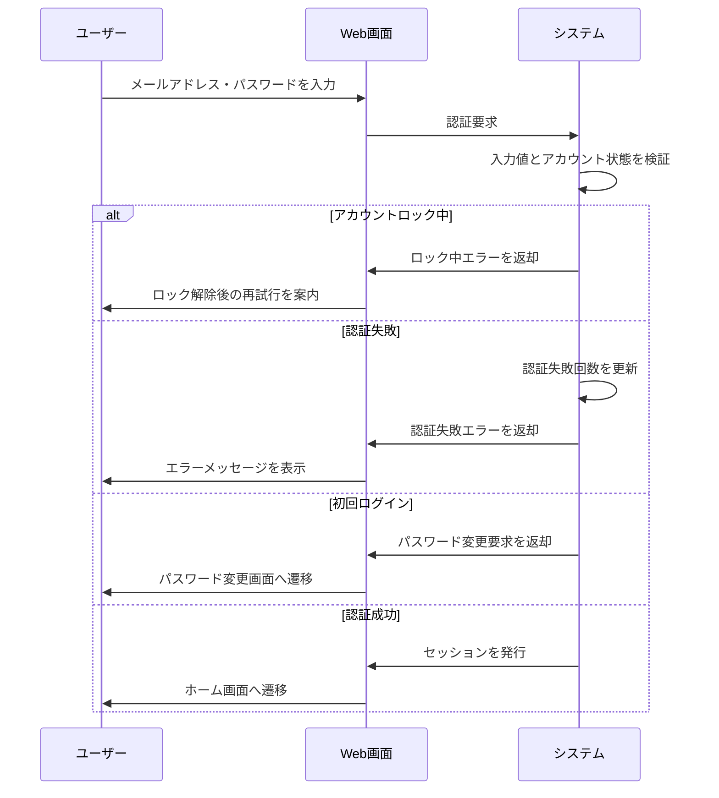

# ログイン画面の要件

## 1. 概要

### 1.1 目的

ユーザーがメールアドレスとパスワードで安全に認証し、システムを利用開始できるようにする。

### 1.2 機能一覧

- ログイン
- 認証失敗回数の記録
- アカウントロック
- 初回ログイン時のパスワード変更強制
- ログアウト

### 1.3 用語定義

| 用語 | 説明 |
| --- | --- |
| 認証 | ユーザーが本人であることを確認する処理 |
| セッション | 認証済み状態を保持する仕組み |
| アカウントロック | 連続した認証失敗後、一定時間ログインを制限する状態 |

### 1.4 想定利用者

| 種別 | 説明 | 操作範囲 |
| --- | --- | --- |
| 未認証ユーザー | ログイン前のユーザー | ログインフォーム送信 |
| 認証済みユーザー | ログイン済みのユーザー | ログアウト、パスワード変更 |

---

## 2. 処理フロー

---

## 3. 機能要件

### 3.1 ログイン機能

ユーザーがメールアドレスとパスワードでログインできる。

#### 条件

**基本情報**

| 項目 | 内容 |
| --- | --- |
| 実行者 | 未認証ユーザー |
| トリガー | ログインフォーム送信 |

**前提条件**

なし

#### 入力

| 項目 | 型・形式 | 必須 | 制約 |
| --- | --- | --- | --- |
| メールアドレス | 文字列（email形式） | ○ | 254文字以内 |
| パスワード | 文字列 | ○ | 8文字以上、128文字以内 |

#### 処理

1. メールアドレスとパスワードの入力有無を検証する
2. メールアドレスの形式を検証する
3. メールアドレスに一致するユーザーを検索する
4. ユーザーがロック中の場合、認証処理を中断する
5. パスワードを照合する
6. 認証失敗の場合、失敗回数を更新する
7. 認証成功の場合、失敗回数をリセットする
8. 初回ログインの場合、パスワード変更画面へ遷移させる
9. 初回ログインでない場合、セッションを発行する

#### 出力

##### 正常系

| 状態変化 | ユーザーへの通知 |
| --- | --- |
| セッションが発行される | ホーム画面へ遷移 |
| 初回ログイン状態が検出される | パスワード変更画面へ遷移 |

##### 異常系

| エラー条件 | 通知 | 表示位置 |
| --- | --- | --- |
| メールアドレスが空 | 「メールアドレスを入力してください」 | フィールド下 |
| パスワードが空 | 「パスワードを入力してください」 | フィールド下 |
| メールアドレス形式不正 | 「有効なメールアドレスを入力してください」 | フィールド下 |
| 認証失敗 | 「メールアドレスまたはパスワードが正しくありません」 | フォーム上部 |
| アカウントロック中 | 「認証に複数回失敗したため、しばらくしてから再度お試しください」 | フォーム上部 |

##### 境界値

| ケース | 扱い |
| --- | --- |
| 認証失敗4回目 | ロックせず認証失敗として扱う |
| 認証失敗5回目 | アカウントを30分間ロックする |
| メールアドレス254文字 | 形式が正しければ正常 |
| メールアドレス255文字 | 異常 |
| パスワード8文字 | 正常 |
| パスワード7文字 | 異常 |

---

### 3.2 ログアウト機能

ユーザーが現在のセッションを終了できる。

#### 条件

**基本情報**

| 項目 | 内容 |
| --- | --- |
| 実行者 | 認証済みユーザー |
| トリガー | ログアウト操作 |

**前提条件**

| 条件 | 満たさない場合 |
| --- | --- |
| ユーザーが認証済みである | ログイン画面へ遷移 |

#### 入力

なし

#### 処理

1. 現在のセッションを無効化する
2. ログイン画面へ遷移する

#### 出力

##### 正常系

| 状態変化 | ユーザーへの通知 |
| --- | --- |
| セッションが無効化される | ログイン画面へ遷移 |

##### 異常系

なし

##### 境界値

なし

---

### 3.3 パスワード変更強制機能

初回ログイン時または期限切れ時にパスワード変更を強制する。

#### 条件

**基本情報**

| 項目 | 内容 |
| --- | --- |
| 実行者 | システム |
| トリガー | ログイン成功時 |

**前提条件**

なし

#### 入力

なし

#### 処理

1. パスワード最終変更日時を確認する
2. 初回ログインの場合、パスワード変更画面へ遷移させる
3. パスワード最終変更日から180日以上経過している場合、パスワード変更画面へ遷移させる
4. いずれにも該当しない場合、通常ログインを継続する

#### 出力

##### 正常系

| 状態変化 | ユーザーへの通知 |
| --- | --- |
| パスワード変更が必須になる | 「パスワードの変更が必要です」を表示 |

##### 異常系

なし

##### 境界値

| ケース | 扱い |
| --- | --- |
| 最終変更から179日経過 | 通常ログイン可能 |
| 最終変更から180日経過 | パスワード変更必須 |

---

## 4. セキュリティ仕様

### 4.1 パスワードポリシー

| 項目 | 仕様 |
| --- | --- |
| 最小文字数 | 8文字 |
| 最大文字数 | 128文字 |
| 文字種 | 英字・数字を含む |
| 有効期限 | 180日 |

### 4.2 アカウントロック

| 項目 | 仕様 |
| --- | --- |
| ロック条件 | 連続5回の認証失敗 |
| ロック時間 | 30分 |
| ロック解除方法 | 時間経過または管理者による解除 |

---

## 改定履歴

- 初版: YYYY/MM/DD
